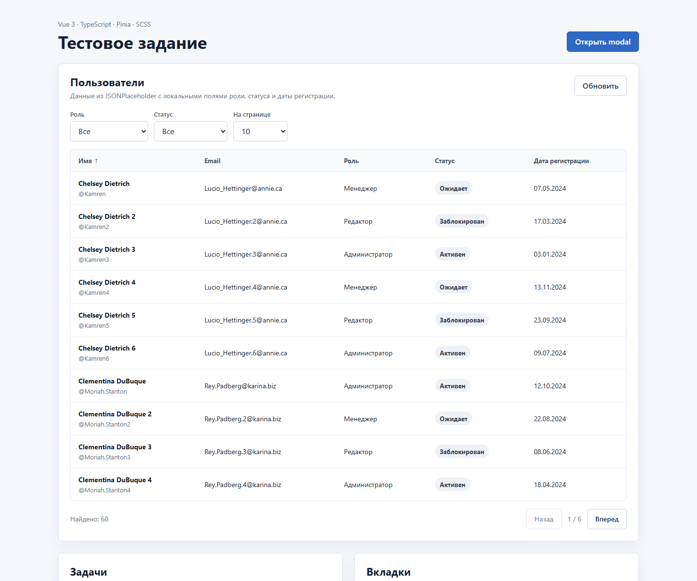

# Frontend Test Assignment

[](https://github.com/toshnotik/vue-users-todos-tabs-feed/actions/workflows/ci.yml)

Vue 3 test assignment with TypeScript, Pinia, Composition API, SCSS and JSONPlaceholder REST API.

## Demo

[Live demo](https://toshnotik.github.io/vue-users-todos-tabs-feed/)

## Screenshot



## Features

- Users table with sorting, role/status filters and pagination.
- Todo list with create, edit, delete, complete and localStorage persistence.
- Tabs with active tab stored in the URL query parameter.
- Feedback form with live validation, submit state and localStorage persistence.
- Accessible modal focus handling and keyboard-friendly tabs.
- Infinite posts feed with Intersection Observer and skeleton loading.
- Reusable modal with slot content, Teleport, overlay close and ESC close.

## Stack

- Vue 3
- TypeScript
- Pinia
- VeeValidate
- SCSS
- Vite
- JSONPlaceholder API

## Quality

- TypeScript strict mode.
- ESLint and Prettier checks.
- GitHub Actions CI for linting, type checking, formatting, tests and production build.
- Keyboard and focus states for interactive UI.

## Getting Started

Install dependencies:

```bash
npm install
```

Run the development server:

```bash
npm run dev
```

Build for production:

```bash
npm run build
```

Run linting:

```bash
npm run lint
```

Run type checking:

```bash
npm run typecheck
```

Run tests:

```bash
npm run test
```

Check formatting:

```bash
npm run format:check
```

Preview the production build:

```bash
npm run preview
```

## Notes

JSONPlaceholder returns only 10 users, so the API layer expands that data to 60 table rows. This keeps the real `/users` endpoint in use while making pagination and page-size controls easy to test.

Authentication, realtime updates and push notifications are outside the assignment scope. Offline behavior is represented by clear network error states with retry actions for API-driven sections.
